# 💻Watson Assistant HelloWorld 
## BUS 118I Digital Innovation

---

## 🎯 Learning Goal: 
- Set up an IBM Cloud account
- Build the first Watson Assistant instance
- Launch your Watson Assistant

---

## ⏱️ Estimated time: 
- 15 minutes

---

## 📚 Additional resources:
- [Watson Assistant Documentation](https://cloud.ibm.com/docs/assistant?topic=assistant-getting-started)

---

## 🪜Steps:

## 🧑‍💻 Part 1. Creating your first Watson Assistant
1. Follow the steps in this doc to create your IBM Cloud account: [https://docs.google.com/document/d/1YZMJpgNca6eiQeVaQArpn5r8f-JPSi8M8gcuQo9-7ns/edit?usp=sharing]
2. Search for **“Watson Assistant”** in the search bar in the top menu, then click on the **“Watson Assistant”** service under “Catalog Results”
3. **Submit a screenshot of this screen with your profile name on the menu bar (Instead of “Esha Padmawar”) like the below screenshot to get credit**

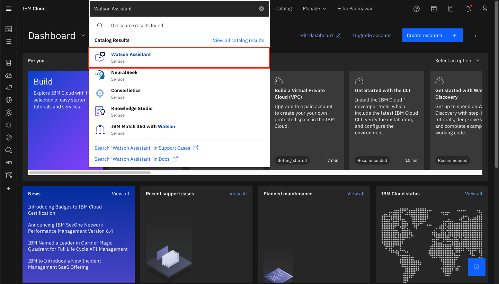 

4. On the right hand side of the page, check the “I have read and agree to the following license agreements:” box and click Create. 

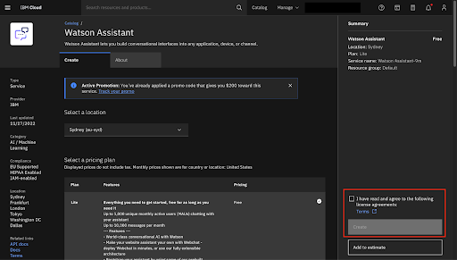 

5. Next, you’ll be redirected to the Watson Assistant launch page, click on **“Launch Watson Assistant”** to start the service. 

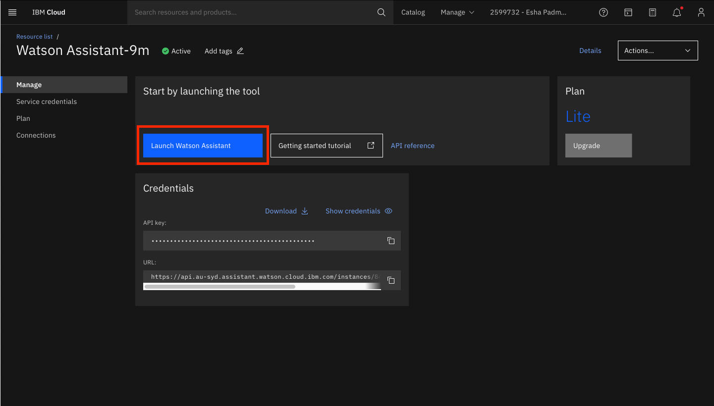 

6. A new browser tab will be opened. On the “Welcome to watsonx Assistant” page, type **“My first assistant”** under Assistant Name and click Next.

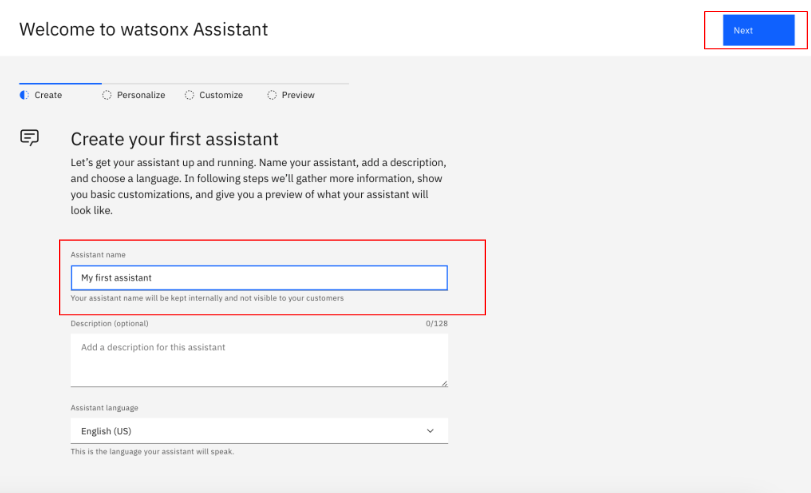 
7. On the “Personalize your assistant” page, select **“Web”** under “Tell us where your assistant will live”. Under “Which industry do you work in?”, select **“N/A (I am a student)”**. Under “What is your role on the team building the assistant?”, select **“Developer”**. Under “Which statement describes your needs best?” select **“I’m using the product to complete a course or certification”** and click Next.

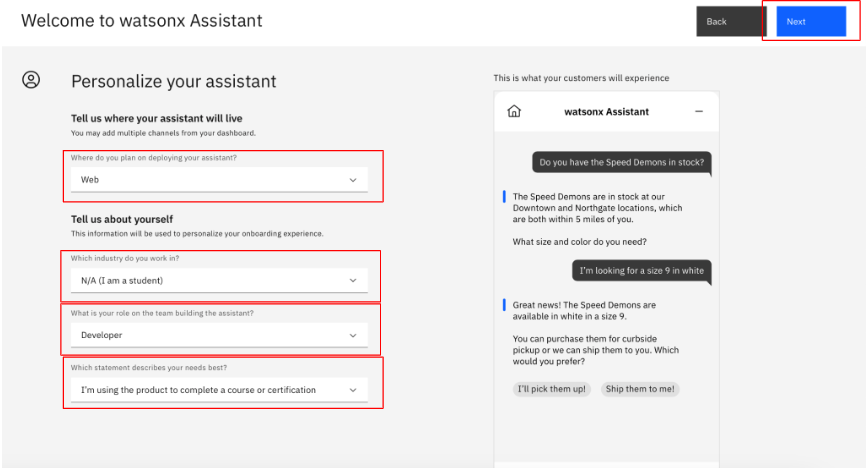 

8. On the “Customize your chat UI” page, just click **Next**. 

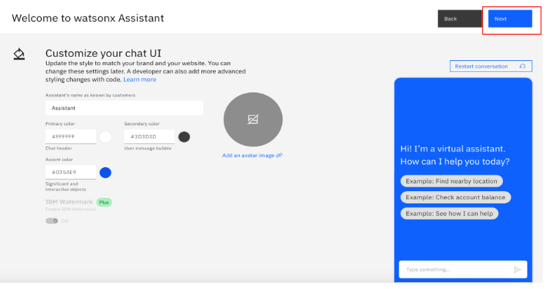
9. On the “Preview your assistant” page, click on **Create.**

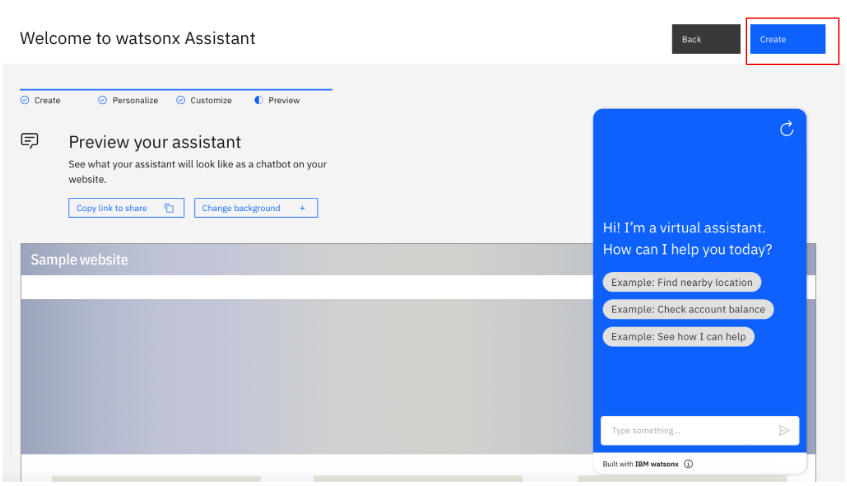

10. On the side bar, click on **“Assistant settings”.**

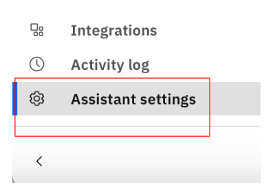 

11. Scroll down and click on **“Activate dialog”.** Click on **“Activate dialog”** again on the pop-up.
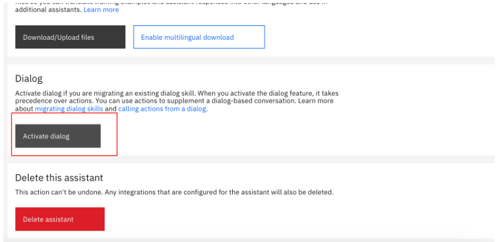  

12. On the side bar, click on the new Dialog button.

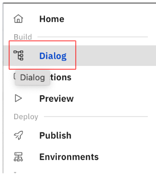 

13. Select the **Welcome** node and modify the text under “**Assistant responds”** to “Hello. This is a chatbot created by (insert your name).” 

*****Important**: The screenshot below shows where you should type, not what you should type to get credit for the assignment.

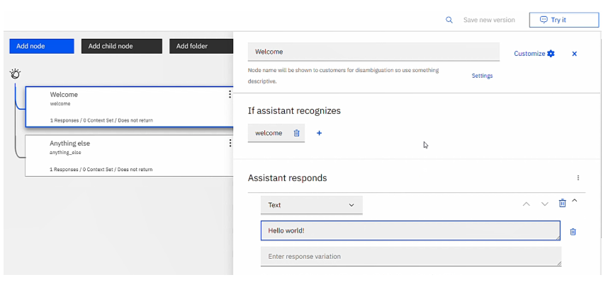 

14. Try the chatbot with the **“Try it”** panel on the upper right hand corner. The chatbot should now display what you wrote from Step 8. Note: If chatbot is not displaying updated text, hit “Clear” and the updated text should show. 

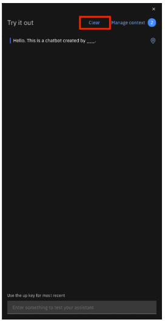 

15. **Submit a screenshot like the one below, to get credit for the assignment**

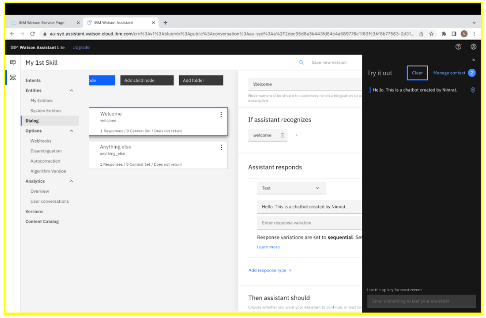

---

## 🚀 Part 2. Launch your chatbot

1. Click on **Preview** on the side bar. 

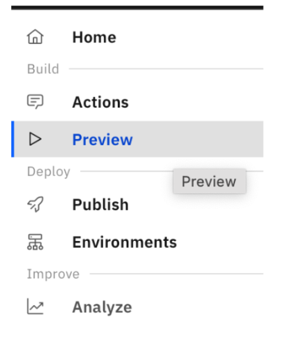 

2. On the “Preview assistant” page, click on **“Customize web chat”**.
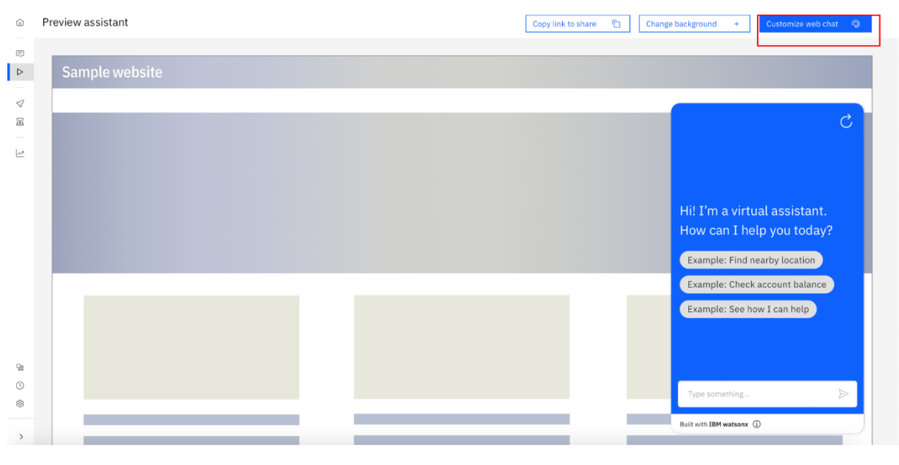

3. Select the **“Home screen”** tab and switch the setting from on to off. 
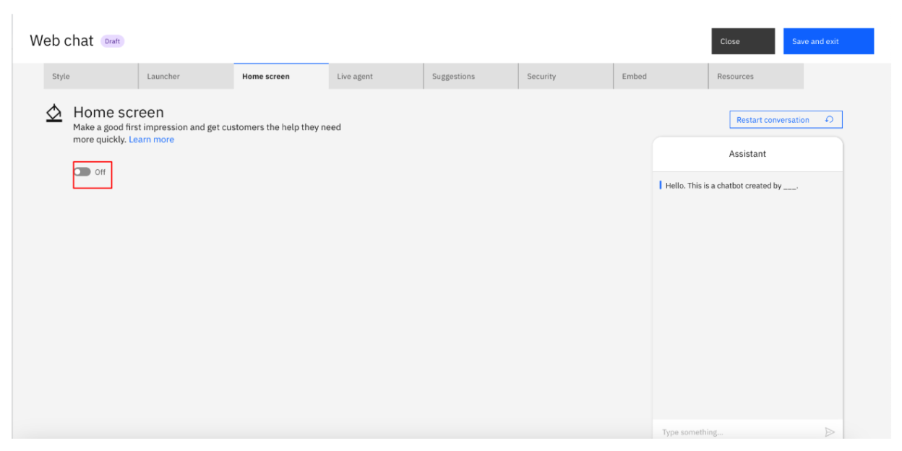

4. Back on the “Preview assistant” page, you can see how your chatbot will look to users on the right hand side. Copy the URL generated under **“Copy link to share”** to send it out to users. 
*****Important:** If the chatbot preview does not show up, refresh the page.

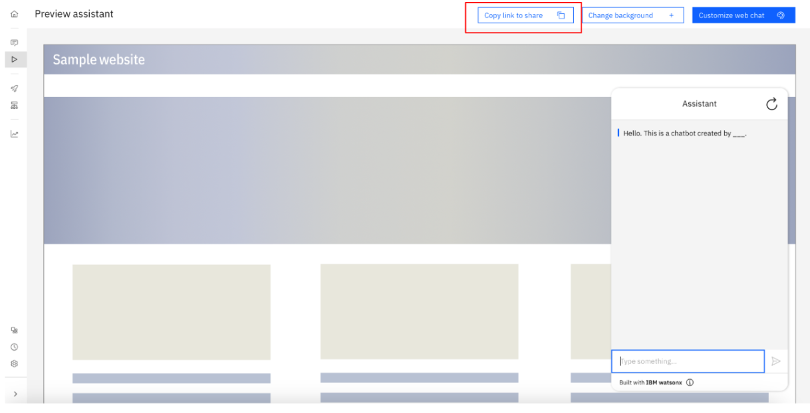  

5. **Open the preview link on your mobile device, then take a screenshot like the following image to get credit for your work.**

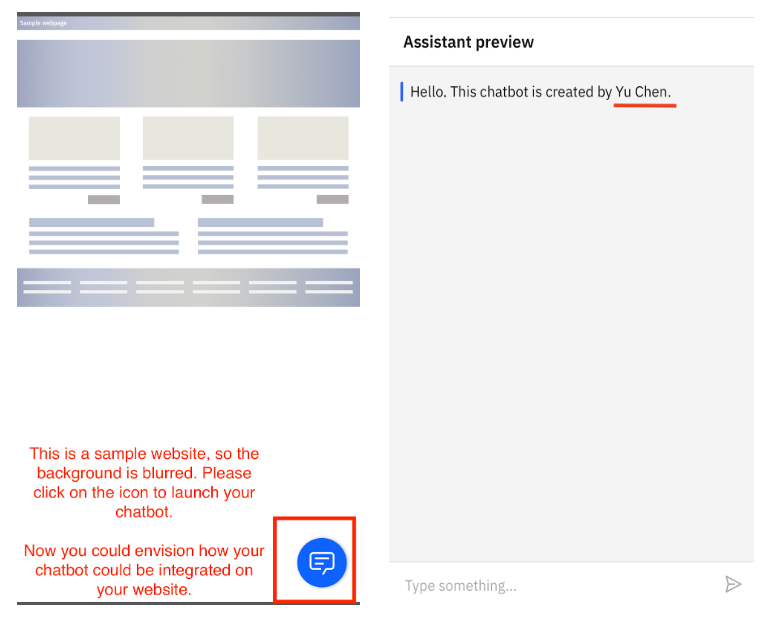

---

## 🎉 Congratulations on completing the lab; your foundational work with Watson Assistant is now complete!

  
